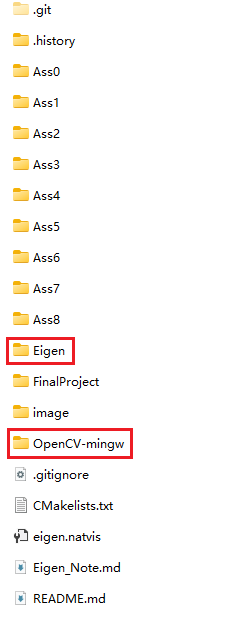

# Games101_ASS

- This is a record of my personal assignments while taking the [GAMES101 course](https://www.bilibili.com/video/BV1X7411F744/?spm_id_from=333.1387.homepage.video_card.click)
- Platform
  - `Windows`+`vsc`/`VS`+ `Cmake `+`MinGW`
  - 代码提示使用[Clangd](https://clangd.llvm.org/)替换`intellisense`
- Environment

  1. [Eigen](https://gitlab.com/libeigen/eigen)、`MinGW`或`MSVC`编译的[OpenCV](https://github.com/opencv/opencv) 库（视你编译源代码所使用的编译器而定），个人做法是直接将库文件放置在作业根目录，子文件夹的`CMakelists,txt`中使用相对路径来链接库：
  
  ```cmake
  include_directories("../Eigen/include")

  list(APPEND CMAKE_PREFIX_PATH "../OpenCV-mingw/x64/mingw/lib")
  find_package(OpenCV REQUIRED)
  ```
  2. 作业5按给出的CMakelists可能报错 `ld.exe: cannot find -lubsan: No such file or directory`
  - ubsan（Undefined Behavior Sanitizer，未定义行为检测工具）是 GCC/Clang 提供的一种 **运行时检测工具**，用于在程序运行时捕获 **未定义行为**（UB, Undefined Behavior）
  - MinGW-w64里的GCC并不带有ubsan
  - 去掉`-fsanitize=undefined`可正常运行
  ```cmake
  target_compile_options(RayTracing PUBLIC -Wall -Wextra -pedantic -Wshadow -Wreturn-type)
  # target_compile_options(RayTracing PUBLIC -Wall -Wextra -pedantic -Wshadow -Wreturn-type -fsanitize=undefined)
  target_compile_features(RayTracing PUBLIC cxx_std_17)
  # target_link_libraries(RayTracing PUBLIC -fsanitize=undefined)
  ```
  3. 作业8需要的`RandR`库不支持windows，必须在linux系统完成
- Notice

  1. Eigen库在调试时的可视化需要`eigen.natvis`文件支持，详细参考[Eigen_Note](Eigen_Note.md)


---

# ASS0

- 实际上头文件只需要包含`<Eigen/Dense>`，`Core`是被包含在`Dense`里的
- `extra.cpp` 演示额外的Eigen操作，包括求逆，求转置，叉积，归一化向量